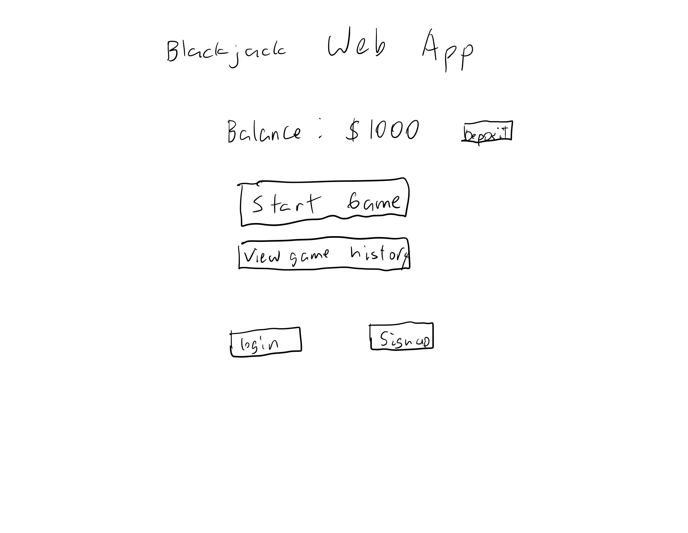
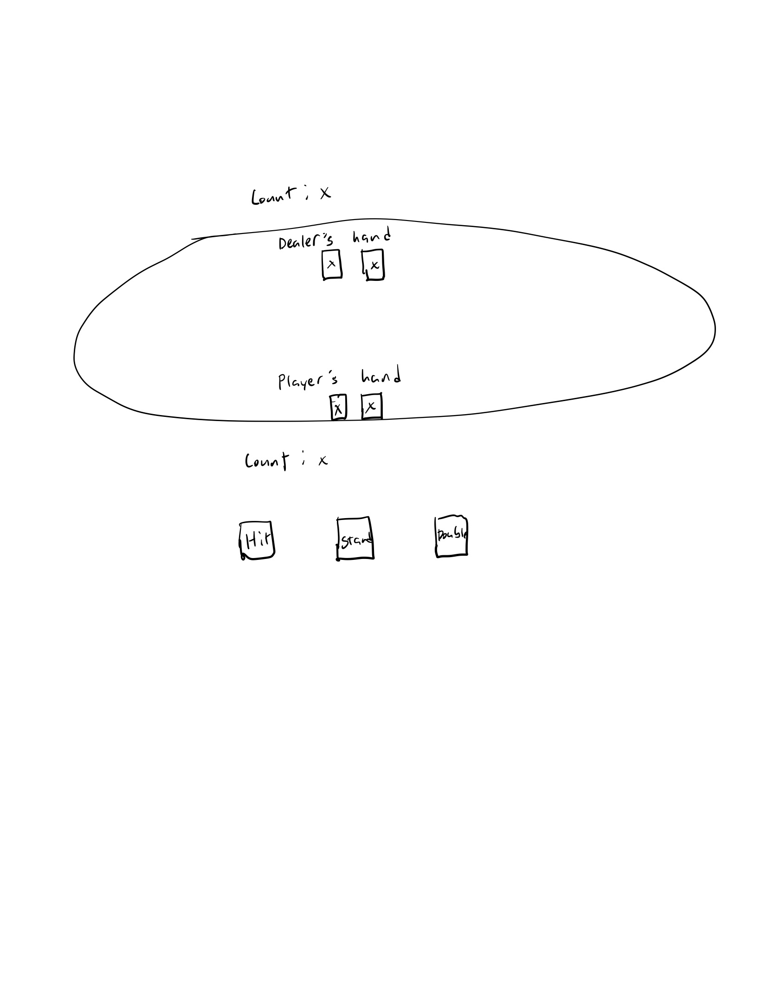
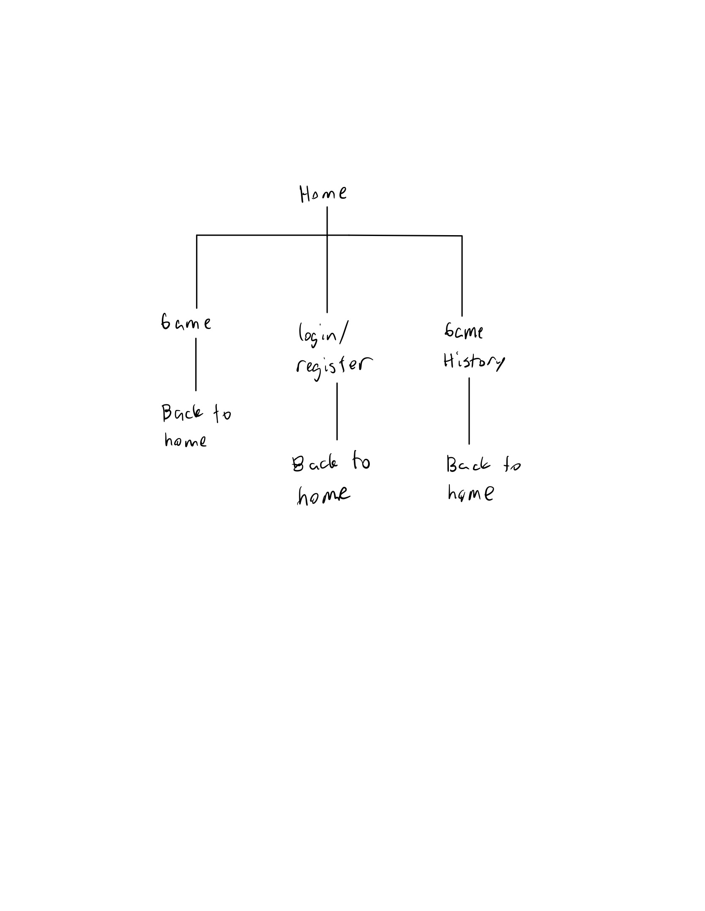

The content below is an example project proposal / requirements document. Replace the text below the lines marked "__TODO__" with details specific to your project. Remove the "TODO" lines.

(__TODO__: your project name)

# Blackjack Web Application 

## Overview

(__TODO__: a brief one or two paragraph, high-level description of your project)

This project is a free-to-play blackjack game built as a web application using Express.js, MongoDB, and React. The application will allow users to play blackjack against a dealer, track their game history, and implement basic game logic following standard blackjack rules. The frontend will be built using React, while the backend will handle game logic, user management, and data storage.

## Data Model

(__TODO__: a description of your application's data and their relationships to each other) 

The application will store Users and Games:

* Users can play multiple games
* Each game will store information about the player's hand, dealer's hand, and game result

(__TODO__: sample documents)

User Schema:

```javascript
{
  username: "blackjackplayer",
  balance: 1000,
  gamesPlayed: [ // references to Game documents
    "gameId1",
    "gameId2"
  ]
}
```

Game Schema:

```javascript
{
  userId: "someUserId", // reference to a User object
  playerHand: ["A♠", "K♣"],
  dealerHand: ["J♦", "6♠"],
  result: "win", // "win", "lose", or "push"
  createdAt: "2025-03-19T14:00:00.000Z"
}
```

## [Link to Commented First Draft Schema](db.mjs) 

(__TODO__: create a first draft of your Schemas in db.mjs and link to it)

## Wireframes

(__TODO__: wireframes for all of the pages on your site; they can be as simple as photos of drawings or you can use a tool like Balsamiq, Omnigraffle, etc.)

/ - Home page for checking balance, starting game, viewing game history, logging in, and signing up 



/gameplay - page for playing the game




## Site map



(__TODO__: draw out a site map that shows how pages are related to each other)

Here's a [complex example from wikipedia](https://upload.wikimedia.org/wikipedia/commons/2/20/Sitemap_google.jpg), but you can create one without the screenshots, drop shadows, etc. ... just names of pages and where they flow to.

## User Stories or Use Cases

(__TODO__: write out how your application will be used through [user stories](http://en.wikipedia.org/wiki/User_story#Format) and / or [use cases](https://en.wikipedia.org/wiki/Use_case))

1. As a new user, I can register an account.
2. As a user, I can log in to the site.
3. As a user, I can start a blackjack game.
4. As a user, I can see my hand and dealer's hand.
5. As a user, I can hit, stand, or double down.
6. As a user, I can view my past games in my dashboard.
7. As a user, I can see my balance change after each game.

## Research Topics

(__TODO__: the research topics that you're planning on working on along with their point values... and the total points of research topics listed)

* (5 points) React Frontend Development
    * Using React for state management and UI updates.
    * React components for game elements (cards, buttons, results).
* (3 points) Tailwind CSS for Styling
    * Using Tailwind CSS to design a responsive, modern UI.
* (2 points) ESLint Integration
    * Setting up ESLint with Prettier for code consistency.

10 points total out of 8 required points (___TODO__: addtional points will __not__ count for extra credit)


## [Link to Initial Main Project File](app.mjs) 

(__TODO__: create a skeleton Express application with a package.json, app.mjs, views folder, etc. ... and link to your initial app.mjs)

## Annotations / References Used

(__TODO__: list any tutorials/references/etc. that you've based your code off of)

1. React Documentation(https://react.dev/) - Used for frontend development.
2. Tailwind CSS Docs(https://tailwindcss.com/docs/installation/using-vite) - Used for styling.

